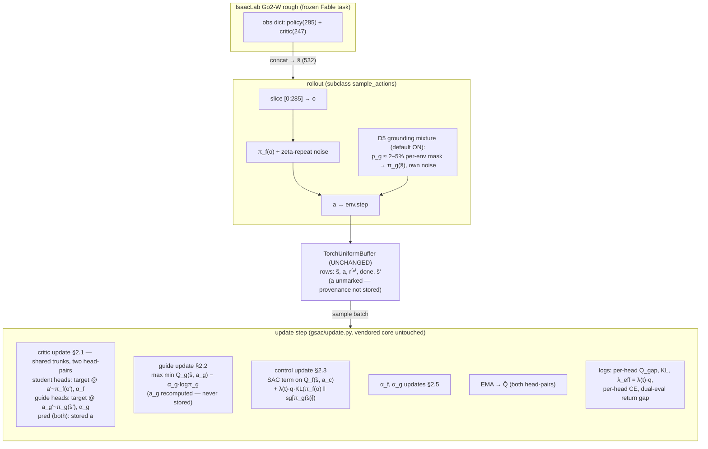
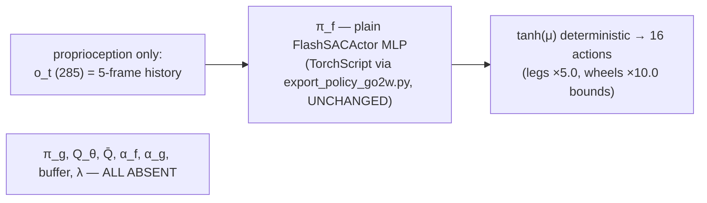

# Single-Agent Guided SAC for Go2-W — Design Note (Deliverable 1)

**Status:** rev. 3 — **final, approved 2026-08-19**. Rev. 3 adds three documentation items from the sign-off review: n-step contamination of the guide heads (§2.1), the `p_g` curriculum-stall risk with its ramp-in escape hatch and the coverage-decay risk with its monitored response (§6), plus the A4 relabel and the softened `q̄`-saturation claim.

**Implementation (Deliverable 2, landed 2026-08-19):** `flashsac_go2w_fable/gsac/` — `config.py` (GuidedFlashSACConfig + λ/p_g schedules + fail-fast validation), `network.py` (GuidedDoubleCritic, two head-pairs on shared trunks), `update.py` (the §2 losses, equation-cited), `agent.py` (GuidedFlashSACAgent subclass). Launcher: `train.py --guided` (banner, provenance overrides, `create_agent`/`evaluate` shims; vanilla path untouched, vendored `flash_rl` byte-identical). Guided checkpoints: `export_policy_go2w.py` and `eval_suite/tok2026/sac_policy.py` auto-detect them and load actor-only. Tests: `tests/test_gsac.py` (11 tests, §5 battery) — all pass alongside the pre-existing `test_wiring.py`.
**Rev. 2 changes (first review incorporated):** the guide gets its own value estimate Q^{π_g} via a second critic head-pair on the shared trunks (D-extra rewritten — the first draft's structural-cap blindspot and its unsound fallback (a) are both corrected); small `p_g` mixing promoted from dormant to recommended default as *grounding* (D5); λ/p_g schedule interaction specified (D-λ); ladder renumbered per review (§3); seed/IQM protocol and `train_guide` flag added (§5, §3).
**Base implementation:** `quadruped_lab-tamer-env/flashsac_go2w_fable` (TOK pipeline; vendored `flash_rl` core stays byte-identical).
**Future code home (Deliverable 2, after approval):** `flashsac_go2w_fable/gsac/` — `GuidedFlashSACAgent(FlashSACAgent)` subclass behind a `--guided` flag.

Sources cited as: **Çerçi Eq. (N)** = Çerçi & Temeltaş 2024 (transcription in this directory, corrected forms per its Transcription Notes); **H&T 2021** = Haklıdır & Temeltaş, Guided SAC; **roadmap** = `guided_sac_yol_haritasi.md`; **tok.md** = the TOK 2026 handover note. Code refs are to the vendored FlashSAC tree.

---

## 0. What FlashSAC already gives us (read this first — it shapes every answer)

Four facts about the base code determine most of the design, and they were verified against the source this session:

1. **The asymmetric critic (roadmap mechanism M1) already exists.** With `asymmetric_observation: true`, the env wrapper concatenates the policy and critic observation groups and the buffer stores the full vector; the critic consumes all of it, the actor slices a prefix (`flash_rl/agents/flashSAC/agent.py:481-483`, `flash_rl/envs/isaaclab.py:99-113`). The TOK blind arm *is* the roadmap's A2 configuration. Guided SAC here is therefore an increment on A2, not on vanilla SAC.
2. **The privileged state is stored in the buffer, row-aligned with the action.** So the guiding action `a_g` never needs to be stored: it can be recomputed at update time from the sampled batch. Çerçi's released code does exactly this (`masac.py:161` recomputes `guiding_act` from the sampled observations), despite Algorithm 2 line 10 listing `a_g` in the stored tuple. Recomputation eliminates the buffer schema change, eliminates stale-teacher actions, and makes `a_g`↔`s_priv` alignment true by construction.
3. **The actor loss already contains an imitation-shaped slot**: the `bc_alpha` term `bc_alpha · mean|Q| · ‖a − a_batch‖²` (`flash_rl/agents/flashSAC/update.py:128-132`, after arXiv:2306.02451). The guided imitation term is structurally the same object with a different target and weight; the `mean|Q|` scale-coupling precedent is adopted below.
4. **FlashSAC has no V-network and no scalar critic.** It uses a categorical (distributional) twin-Q with an EMA target network and n-step returns (n=3). Any design element that assumes a scalar MSE critic or a separate V(s) — both present in Çerçi — must be mapped, not copied.

---

## 1. The D1–D9 decisions

Each answer: position, justification, integration cost across the four axes the prompt names (replay buffer / network factory / rollout loop / update step), and whether the cost changes the recommendation.

### D1 — Guiding actor network: **fully separate network**

A second `FlashSACActor` instance with `input_dim = 532` (the full stored observation; see §3), its own optimizer, LR schedule, and weight normalization. No parameter sharing with the control actor in any form. A shared trunk would put privileged-gradient information into weights the deployed policy uses — exactly the failure mode the isolation tests exist to catch — and the savings are small: the actor is the cheap network in this pipeline (the ensemble critic dominates), and the guide's forward cost at update time is one extra batch pass. The paper also uses fully separate networks (Çerçi §IV.A, Figure 3).

*Integration cost:* network factory — one more `_init_flashsac_networks`-style construction (actor + temperature; the critic gains a head-pair per D-extra, not a second critic). Buffer: none. Rollout: the D5 mixture (masked guide forward). Update: one added actor update call. **Cost is near-zero; it does not change the recommendation.**

### D2 — Control actor's memory: **frame stack, K=5 (the existing contract)**

The Fable task already delivers the actor a flattened 5-frame history (285 = 5×57, `observations.policy.history_length`), and the TOK blind arm demonstrated this is sufficient memory to learn omnidirectional motion on this platform. The constraint the prompt asked me to check is decisive: `TorchUniformBuffer` samples i.i.d. transitions and has no sequence machinery, so a GRU/TCN student would require rewriting the vendored buffer and update core — a fork, which the ground rules forbid. Frame stacking keeps the deployed network a plain MLP (deployment constraint) and keeps the buffer untouched.

*Integration cost:* zero everywhere. **No tension between cost and recommendation.**

### D3 — How privileged information reaches the actor: **critic (M1, existing) + soft action-space imitation; latent encoder deferred-and-planned**

The first implementation adds only the soft imitation channel (M3) on top of the existing asymmetric critic (M1). Two reasons. First, ladder integrity: the roadmap's Faz-1 ablation (its stated highest-value experiment) needs A5 (imitation) and A3 (latent supervision) as *separable* rungs; building both into the first system would confound the one comparison — A5 vs A2 — that decides whether the guiding actor earns its place. Second, paper fidelity: this deliverable is "Guided SAC"; the latent channel is a different method (HIM/RMA family) that the roadmap positions as the *successor* if A5 ≤ A2.

To be precise about scope (correcting an earlier draft): a plain regression encoder (`ẑ = E_ψ(o)`, `L_enc = ‖ẑ − z_priv‖²`) is **not** the Robust Adaptation Module — DAM is epistemic-uncertainty-gated (confidence-weighted `α_t`), which is genuinely out of scope; the plain encoder is merely deferred. **A3 is planned, not rejected**: it is the main antidote to the imitation gap, and the mitigations built into this design (KL rather than L2, λ annealed to zero, the superiority test as a guard) are weaker measures and are claimed only as such. The subclass structure keeps the A3 slot open: the encoder would attach to the control actor's input path without touching the buffer or critic.

*Integration cost of the chosen channel:* update step only (one KL term + schedule; §2.3). Buffer: none (fact 2 in §0). Factory: covered by D1. Rollout: none. **Low cost; recommendation unchanged.**

### D4 — Value network: **twin-Q with EMA targets only; no V(s)**

Çerçi keeps the 2018-SAC V-network (Eqs. 20–21); SAC itself dropped it in the 2019 revision because target Q-networks subsume its stabilizing role. Here the integration cost is decisive on top of that: FlashSAC's critic is categorical, so a faithful V would have to be a categorical V with its own projection step, wired into a vendored TD path (`update.py:200-250`) that currently has no seam for it — that is a core rewrite, i.e. a fork.

What is actually lost must be stated precisely, because Çerçi's V does **two** jobs: (i) it routes other agents' guiding actions into the TD target (Eq. 21's `Q(s, a^{g_1},…,a^{c_i},…,a^{g_k})`), and (ii) it puts guiding actions into the value function's *training distribution*. Job (i) vanishes at k=1 (see D7). Job (ii) does not vanish — and rev. 2 reinstates it in modern form: the guide-bootstrapped critic heads of D-extra are the twin-Q-era analogue of Çerçi's V, a value estimate that carries the guide's own continuation and entropy (cf. Eq. (21)'s `α log π(a^g|s)` term, the k=1 residue D7 records). V is dropped as a *network*; neither of its jobs is silently lost.

*Integration cost of keeping V:* high (vendored TD-path rewrite). *Of dropping it:* zero; the guide heads are costed in D-extra. **Cost strongly reinforces the recommendation.**

### D5 — Behavior policy mixing: **probabilistic mixture with small `p_g` (2–5%), on by default — as *grounding*, not exploration; M2-as-exploration remains rejected**

(rev. 2 — the first draft said supervise-only; the review overturned it.) The guiding actor executes in a small, per-env Bernoulli-masked fraction of environment steps: with probability `p_g`, an env executes `π_g(s̃)` instead of `π_f(o)`. The reason is **not** the roadmap's M2. That analysis stands: shaped-reward locomotion at this parallelism is not exploration-bottlenecked, and a *large* `p_g` would re-open the off-policy distribution-shift concern (roadmap §2.2). The reason is **value-estimation coverage**: the guide never acting is the sole reason `(s̃, a_g)` pairs are absent from the training data, and both predecessors had a grounding channel the supervise-only draft removed — H&T 2021's teacher acted in strict alternation (its Eq. 11), and Çerçi's k>1 construction put guide actions into value targets (Eqs. 13/21). Dropping M2 *and* collapsing to k=1 left the guide with zero grounding, a situation neither predecessor was ever in. A small mixture restores grounding at minimal distribution cost; strict alternation stays rejected as arbitrary.

Mechanics: `p_g` constant from step 0 (grounding must precede the λ ramp — see D-λ), annealed to zero over the schedule tail; the guide samples with its own plain noise, never sharing the student's zeta-repeat cache; mixed-action rows are stored unmarked — off-policy TD needs no provenance bit. A separate **`train_guide` flag** (independent of λ and `p_g`) turns the entire guided path off so that A2 runs carry zero guide cost — without it the guide would train pointlessly and pollute wall-clock comparisons.

*Integration cost:* rollout-loop override in the subclass (mask + guide forward on masked envs); buffer unchanged. The *value* of `p_g` is tuning; 2–5% is the review-directed starting default. **Low cost; the grounding argument, not the cost, is what changed this position.**

### D6 — Imitation metric: **KL divergence, closed form, teacher stop-gradded**

`D_KL(π_f(·|o_t) ‖ sg[π_g(·|s̃_t)])`, computed between the pre-tanh Gaussians. Because tanh is a diffeomorphism applied identically to both distributions, the KL between the squashed policies equals the KL between the underlying Gaussians — so the closed form is exact, not an approximation, and it costs one `get_mean_and_std` call per actor with no sampling variance. KL matches the teacher's variance as well as its mean: where the teacher is uncertain, the student is *allowed* to stay uncertain, instead of being dragged to a point target — the false-confidence failure the roadmap (§2.3) attributes to L2. The mode-seeking direction (student on the left) with `stopgrad` on the teacher follows roadmap 2.3's formulation and prevents the imitation term from degrading the teacher.

Deviations recorded: Çerçi Eq. (18)/(24) uses `|a_g − a_c|` — L1 between single sampled squashed actions (high-variance, mean-only); the GSAC-v12 legged pipeline used L1 on tanh(means) and passed its gates, so L1-on-means is a known-viable fallback if KL misbehaves, but KL is the position here.

*Integration cost:* update step only (a few lines in the new control-actor update; both mean/std heads already exposed). **Negligible; recommendation unchanged.**

### D7 — Which actions the critic sees: **stored actions on the prediction side; per-head bootstrap — the student's head from π_f only** (mandatory single-agent resolution)

The prediction side of the critic loss always uses the **stored** action — whatever produced it (with D5's mixture, a small fraction are guide-produced; off-policy TD is indifferent to provenance). The bootstrap side is **per-head** (rev. 2): the *student heads* bootstrap exclusively with `a' ~ π_f(·|o')`, so they estimate Q^{π_f} — the value of the *deployed* policy (approximately: see the n-step contamination note in §2.1, which applies to both head-pairs) — and they are the only estimate the control actor's loss ever reads; the *guide heads* bootstrap from π_g (D-extra) and are read only by the guide. This sharpens rather than weakens the original resolution. Tracing: Çerçi Eq. (13) evaluates the target with the control action for the agent under evaluation and guiding actions *for the others*; at k=1 there are no others, so Eq. (13) collapses literally to the standard student-head target `y = r + γ min_i Q'(s', π_c(s'^p))`. For Eq. (21) the collapse must be stated more carefully: the Q *arguments* reduce to the control action (the paper's own rule — "the control actor output is used for the relevant agent"), but the entropy term `α log π(a^g|s)` is the guide's log-probability and survives at k=1 — a residue the guide heads now carry (§2.1), recorded so the equation-level tracing stays honest. The first-principles argument stands: the value the *student* optimizes against must evaluate the deployed policy; bootstrapping the student's estimate on teacher actions would make it report value the blind policy cannot realize, worsening the very perceptual-aliasing bias M1 exists to fix.

*Integration cost:* zero for the student path — FlashSAC's existing pipeline is already exactly this; the guide heads are costed in D-extra. **The zero cost is a consequence of the resolution, not its justification.**

### D-extra (unnumbered, but a decision, not a risk) — the guide needs its own value estimate: **two categorical head-pairs on the shared trunks — Q^{π_f} for the student, Q^{π_g} for the guide**

(rev. 2 — supersedes the first draft's "measure-first, fallback (a)" position; the review overturned both halves of it.)

Two distinct defects, which the first draft conflated:

1. **Structural cap — the deeper one.** A critic that bootstraps only with `a' ~ π_f` estimates Q^{π_f}. A guide maximizing `Q^{π_f}(s̃, a_g)` is performing a one-step greedy improvement *over the student*, not solving the fully-observed problem: its improvements never enter the bootstrap, so they never compound — the evaluation half of policy iteration is missing for the teacher. Its advantage over π_f is therefore capped by construction, contradicting the premise (D8, roadmap) that the teacher, seeing everything, is meaningfully better. A superiority-test failure caused by this cap would moreover be hard to attribute — it presents like a weak teacher, and the first draft's logs conflated it with drift.
2. **Off-distribution actions.** The guide queries the critic at `a_g` points that (without D5's mixture) never appear in the training data, so it can climb extrapolation errors unchecked. This was the only defect the first draft saw.

**Fix for (1): option (b), re-costed.** The first draft rejected (b) as "doubling the most expensive network" — that pricing was wrong. The vendored twin critic is two parallel trunk+head networks fused into batched ensemble ops; the guided critic (`gsac/network.py`, a subclass — vendored file untouched) keeps the two trunks and gives each trunk a **second categorical predictor head**: student heads trained toward the π_f-bootstrapped target exactly as today, guide heads toward a π_g-bootstrapped soft target with `α_g` (§2.1). Parameters: one extra `EnsembleCategoricalValue` pair — trivial next to the trunks. Compute: the prediction-side trunk pass at the stored action is shared by both heads; the genuinely new work is one target-net pass at `(s̃', a_g' ~ π_g(s̃'))` plus the head CE — well under the 2× of a full second critic. The guide now optimizes against its own fixed point: improve vs Q^{π_g}, guide heads re-evaluate Q^{π_g}, improvements compound — the teacher can actually run ahead. D7 is intact: the student's loss reads only the π_f-bootstrapped heads. (Ensemble-native fallback if the two-head structure fights torch.compile: `num_qs` 2→4, two members per policy — ~2× trunk compute, second choice.)

**Fix for (2): D5's small `p_g` mixture** — coverage from real execution. The first draft's fallback (a) — regressing `Q(s̃, a_g)` onto the stored transition's n-step target — is **removed as unsound**: that target is the return of having executed the *stored* action `a_t`, so the regression teaches `Q(s̃, a_g) = Q(s̃, a_t)` for arbitrary `a_g`, flattening the critic across actions and destroying exactly the discrimination the guide needs. No fabricated target grounds `a_g`; only execution does.

Trunk-sharing watch item: both head-pairs' CE gradients train the shared trunks. The two value functions differ only in continuation policy, so shared features are plausible — interference is monitored (per-head CE losses logged separately), with the ensemble-native variant as the escape hatch.

Diagnostics (kept, now sharper): per-head `Q_gap = mean[min_i Q_g,i(s̃,a_g) − min_i Q_f,i(s̃,a_c)]` against the dual-eval realized gap `J(π_g) − J(π_f)`. With the structural cap removed, a persistent divergence — heads say the guide is better, environment says it is not — now points specifically at residual extrapolation drift or head interference.

*Integration cost:* network factory (subclassed critic; the EMA target clone picks the guide heads up automatically); update step (one extra target computation + guide-head CE; guide update reads guide heads); buffer none; rollout covered by D5. **The corrected cost estimate is what makes (b) the right answer — the first draft's arithmetic, not its logic, was the error.**

### D8 — Entropy temperature: **separate α_f and α_g**

Two `FlashSACTemperature` instances with independent optimizers, both driven to the same target entropy `H̄ = ½·d_a·log(2πe·σ_target²)` (identical action dimensionality). The guide solves the easier, fully-observed problem and will legitimately settle at a different exploration level; yoking both to one temperature distorts whichever converges first. The paper shares a single *fixed* α across both actors (Eqs. 23–24) — a deviation recorded in §2.5. Two empirical constraints from this project's history are binding: the learned temperature collapses to ~5.8×10⁻⁴ at convergence in this pipeline (tok.md §8.2), and every α-clamping intervention in the v12 legged campaign destroyed learning — **no α floors, clamps, or freezes on either temperature.**

Rev. 2 makes this separation load-bearing rather than cosmetic: `α_g` now enters the guide heads' soft bootstrap target (§2.1), so the teacher's temperature shapes its own value estimate, exactly as `α_f` shapes the student's.

*Integration cost:* factory (one small module) + one extra `update_temperature` call using the guide's entropy. **Trivial; recommendation unchanged.**

### D9 — DR parameters in the critic: **not in the first implementation** (frozen 247 contract), extension designed in

Decision taken with the project owner this session: the privileged group stays the frozen Fable 247 (no `ξ_DR`, friction, contact forces, or mass/COM), because the env is the contract shared with the TOK PPO/SAC arms and changing it forfeits comparability. This **defers the roadmap's Faz 3.1 remedy** for the multimodal-Q pathology (the leading explanation for the historical rough-terrain crouch collapse) — recorded here as an explicit, owner-approved roadmap deviation, not an oversight. The design keeps the extension config-only: all widths are derived from env metadata (`actor_observation_size`, observation-space shape), never hardcoded, so a later task variant with an enlarged critic group changes zero agent code. Until then, the partial mitigations already in the stack (reward normalization, categorical critic, n-step returns) and curriculum-level logging are the guard.

*Integration cost now:* zero. *Later:* a new task registration only. **Cost is why the deferral is safe.**

### D-λ (the required unnumbered question) — fixed λ or a schedule: **trapezoid schedule in env steps, Q-scale-coupled**

λ is scheduled, never constant. Shape: **0 → λ_max over a warmup ramp, hold, then anneal → 0 before the end of training.** The rise-from-zero is a hard requirement imported from direct experience: in the v12 legged GSAC campaign, every run with λ_init > 0 on the fragile-curriculum task failed (terrain stuck at 0), and the 0-warmup recipe was the first ever to pass — the teacher is noise before it converges, exactly as the roadmap's Faz 2.1 argues. The anneal-to-zero tail is roadmap 2.1's second half: the student must finish under its own constraints, which is also the cheapest structural mitigation of the imitation gap. The effective weight is `λ(t) · mean|min Q|.detach()`, adopting the codebase's own `bc_alpha` precedent so λ stays dimensionless against the growing Q scale. Roadmap 2.1's performance-gated variant (λ as a sigmoid of teacher return) is noted and deferred — 2.1 itself offers "veya daha basiti", and a deterministic env-step schedule is reproducible and seed-independent. The schedule's breakpoint *values* are tuning and are out of scope; the *mechanism* (three-segment schedule, config-exposed) is architecture and is in scope.

**Schedule interaction (review-flagged, resolved).** During the λ=0 warmup the imitation term is off — the guide→student→buffer→critic loop is closed exactly when the guide is most fragile. Rev. 2 makes this safe by construction rather than by accident: the guide's *grounding* channels — the π_g-bootstrapped heads (D-extra) and the `p_g` mixture (D5) — are active from step 0 and do not depend on λ. The ordering principle is **grounding before guidance**: `p_g` is constant from t=0 through the λ-hold, then annealed to zero over the same tail window as λ; λ rises only after its warmup. Early guide actions being noise is harmless — the buffer opens with uniform random warm-up actions anyway.

**Double damping (review-flagged): intended.** Early in training both `λ(t)` and `q̄` suppress the imitation term. They gate different things — `λ(t)` gates on schedule (teacher maturity by proxy), `q̄` on value scale — and `q̄` is *expected* to saturate early, since the `RewardNormalizer` bounds returns by `G_max`; after saturation `λ(t)` is the only active modulator. That is a reasonable assumption, not yet a measured fact — it is verified from the `λ_eff = λ(t)·q̄` logs, which exist so the compound gate is visible, not inferred.

*Integration cost:* config fields + a pure function of `env_step`; the subclass already receives the step. **Trivial.**

---

## 2. The exact losses

### 2.0 Symbols

| Symbol | Meaning | Dim / value |
|---|---|---|
| `o_t` | proprioceptive actor observation (noisy, 5-frame history) | 285 |
| `s_t` | privileged critic group (clean, single frame) | 247 |
| `s̃_t = [o_t ‖ s_t]` | full stored observation (buffer row) | 532 |
| `a_t` | stored action from the buffer — whatever produced it (π_f, or π_g on p_g-masked envs) | 16 |
| `π_f(·\|o)` | control actor, tanh-Normal; params φ_f | — |
| `π_g(·\|s̃)` | guiding actor, tanh-Normal; params φ_g | — |
| `μ_f, σ_f / μ_g, σ_g` | pre-tanh mean/std heads of the two actors | 16 each |
| `Q_f,i / Q_g,i, i∈{1,2}` | student / guide categorical head-pairs on the two shared trunks, input `(s̃, a)`; bins `z_1..z_M` on `[V_min, V_max]` | M = `critic_num_bins` |
| `Q̄` | EMA target critic, both head-pairs cloned (`critic_target_update_tau`) | — |
| `p_g` | per-env Bernoulli probability that the guide acts (D5); default 2–5%, annealed to 0 in the tail | scalar |
| `α_f, α_g` | learned temperatures (log-parameterized) | scalars |
| `H̄` | target entropy `½·d_a·log(2πe·σ_target²)`, d_a = 16 | scalar |
| `r_t^{(n)}` | n-step return `Σ_{j<n} γ^j r_{t+j}` (buffer-computed, n = 3) | scalar |
| `λ(t)` | imitation weight schedule (D-λ), t in env steps | scalar |
| `q̄` | `mean_batch \| min_i Q_f,i(s̃, a_c) \|`, detached | scalar |
| `sg[·]` | stop-gradient | — |
| `Π[·]` | categorical projection onto the bin support (`_compute_categorical_td_target`) | — |

### 2.1 Critic loss — traces to Çerçi Eq. (20) (student heads) and Eq. (21)'s role (guide heads)

Both head-pairs share the prediction-side trunk pass at the **stored** action `a_t` — whatever produced it (D7):

```
# ── student heads: Q^{π_f} — unchanged FlashSAC path ─────────────────────────
a'       ~ π_f(·|o_{t+n})                                     # control actor, next obs
target_f = Π[ r_t^{(n)} + γ^n (z − α_f log π_f(a'|o_{t+n})) · (1 − done) ]
           # per-bin, via target-net student heads, min-Q selection
L_Qf     = CE( target_f ‖ Q_f,i(s̃_t, a_t) )   summed over i ∈ {1,2}

# ── guide heads: Q^{π_g} — rev. 2 addition (D-extra) ─────────────────────────
a_g'     ~ π_g(·|s̃_{t+n})                                    # guiding actor, next obs
target_g = Π[ r_t^{(n)} + γ^n (z − α_g log π_g(a_g'|s̃_{t+n})) · (1 − done) ]
           # per-bin, via target-net guide heads, min-Q selection
L_Qg     = CE( target_g ‖ Q_g,i(s̃_t, a_t) )   summed over i ∈ {1,2}

L_Q = L_Qf + L_Qg
```

Mapping. Student half to Çerçi Eq. (20), `y = r + γ V'_ψ(s_{t+1})`, `J_Q = E[(y − Q(s_t, a^c))²]`:

- **`V'_ψ(s_{t+1})` → EMA target heads evaluated at the control actor's next action, entropy inside the target.** The modern-SAC substitution (D4).
- **Scalar MSE → categorical cross-entropy** (FlashSAC's distributional critic; deviation from Eq. (20)'s form, not its role).
- **1-step → n-step (n = 3)** (FlashSAC; deviation from Eq. (20)).
- The prediction-side action is the stored `a_t` — with D5's mixture this is *usually* Eq. (20)'s `a^c` and occasionally `a^g`; off-policy TD is indifferent, and the wording "the control actor is the only behavior policy" from the first draft is retired.

Guide half traces to **Eq. (21)'s role, in twin-Q form**: Çerçi's V was the value estimate carrying the guide's continuation and its entropy — the `α log π(a^g|s)` term that D7 notes survives at k=1. `target_g` is exactly that object under the modern substitution: the guide's own soft continuation value, bootstrapped from `a_g' ~ π_g` with `α_g`. This is the component whose absence in the first draft capped the teacher at one improvement step over the student (D-extra defect 1).

**n-step contamination (review-flagged).** `r_t^{(n)}` is collected along the *behavior* trajectory — 95–98% π_f under D5's mixture — so `target_g` actually teaches `Q_g(s̃_t, a_t)` = "take `a_t`, follow ≈π_f for n−1 steps, *then* continue as π_g": an **n-step-lagged Q^{π_g}** that partially retains the structural cap D-extra removes (the cap is fully removed only at n=1). n=1 for the guide heads alone is **not reachable from the current buffer**: `TorchUniformBuffer` collapses each transition to its n-step start/end at add time (`_get_n_step_prev_transition`) and stores neither `r_t^{(1)}` nor `s̃_{t+1}`. A separately configurable guide-head n therefore requires a buffer extension — per-row 1-step reward and next-observation columns, ≈ +4.3 GB fp32 (+2.1 GB fp16) at the 2M×532 buffer. The config field `guide_n_step` is exposed but non-functional (any value ≠ `n_step` fails fast with this explanation); whether the extension is worth the memory is a **Faz-3 decision**. With n=3 the contamination window is two behavior steps — recorded here so a later superiority shortfall can be attributed correctly.

### 2.2 Guiding actor loss — traces to Çerçi Eq. (23) at k = 1

```
a_g     ~ π_g(·|s̃_t)          # reparameterized; fresh sample from the current guide
L_g(φ_g) = E_batch[ α_g · log π_g(a_g|s̃_t) − min_i Q_g,i(s̃_t, a_g) ]
```

Eq. (23) at k=1 is exactly this (its multi-agent argument list `a^{g_1}..a^{g_k}` collapses to the single `a_g`), with one rev. 2 refinement: the Q read here is the **guide head-pair** `Q_g` — the estimate of the guide's own fixed point (D-extra), not the student's. Deviations: the guide's state input is `s̃` (⊇ the paper's `s`) — see §3 for why this is an advantage, not a compromise; `α_g` is learned per D8 (paper: fixed shared α); log-prob uses the corrected sign of Eq. (22) (Transcription Note O1) with the standard tanh-Jacobian correction, as already implemented in `NormalTanhPolicy`. The critic is *frozen* during this update (`requires_grad_(False)` pattern, as in the existing actor update) — the guide's value estimate is trained only by §2.1's `L_Qg`, never through the actor loss.

### 2.3 Control actor loss — traces to Çerçi Eq. (24) at k = 1, with two deviations

```
a_c     ~ π_f(·|o_t)           # reparameterized
KL_t    = D_KL( N(μ_f(o_t), σ_f(o_t)) ‖ N(sg[μ_g(s̃_t)], sg[σ_g(s̃_t)]) )      # closed form, per-dim summed
        = Σ_j [ log(σ_g,j/σ_f,j) + (σ_f,j² + (μ_f,j − μ_g,j)²) / (2 σ_g,j²) − ½ ]
L_f(φ_f) = E_batch[ α_f · log π_f(a_c|o_t) − min_i Q_f,i(s̃_t, a_c) + λ(t) · q̄ · KL_t ]
```

Eq. (24) at k=1 reads `J = E[ α log π_c(a_c|s) − Q(s, a_c) + |a_g − a_c| ]`. Mapping:

- SAC term: identical in role; Q consumes the privileged `s̃` while the policy consumes `o` — the asymmetric-critic structure (M1) that in the paper is implicit in `Q(s, ·)` vs `π_c(s^p)`.
- **`|a_g − a_c|` → `λ(t) · q̄ · KL_t`**: metric change per D6 (closed-form KL on pre-tanh Gaussians replaces L1 between single sampled squashed actions); weight change per D-λ (the paper's constant unit weight becomes a scheduled, Q-scale-coupled λ). Both deviations are deliberate and argued in §1.
- The tanh-invariance note: KL between the squashed action distributions equals KL between the pre-tanh Gaussians (tanh is a shared diffeomorphism), so no squashing correction appears in `KL_t`.
- Shape resolution the prompt demands: the paper's `π_g(s_i) − π_c(s_i^p)` compares outputs of two networks reading *the same-shaped* vector; here the inputs differ (285 vs 532) but the term compares **action-space distributions (16-dim)**, so no dimensional conflict arises anywhere in the loss. The only place the paper's same-shape assumption had teeth is network construction, resolved by D1 (separate networks with different `input_dim`).

### 2.4 What is *not* implemented from the paper, and why

- **Eq. (1)–(8), (11): the adversarial network `B_δ` and perturbed states** — out of scope by instruction; partial observability here is genuine, not adversarial. `s^p → o` per the prompt's mapping table.
- **Eq. (21): the V-*network*** — dropped (D4), but rev. 2 reinstates its *role*: the guide heads (§2.1) carry the guide's continuation value and entropy in twin-Q form.
- **Eq. (17): the guide-superiority guarantee** — does not transfer. Its proof leans on `s^p` being *adversarially* degraded (via [1]); with genuine partial observability there is no δ* making the inequality structural. Superiority becomes an **empirical obligation** — hence the superiority test is a first-class training-time metric, not an assumption.
- **H&T 2021 Eq. (11) alternating buffer** — strict alternation rejected; replaced by D5's small probabilistic mixture (`p_g` 2–5%), adopted for value grounding, not exploration — M2-as-exploration remains rejected.

### 2.5 Temperature updates — FlashSAC form, one per actor (deviation: paper fixes a shared α)

```
L(α_f) = α_f · (H_f − H̄)      where H_f = −E_batch[log π_f(a_c|o_t)]   (a_c detached)
L(α_g) = α_g · (H_g − H̄)      where H_g = −E_batch[log π_g(a_g|s̃_t)]  (a_g detached)
```

Both use the existing `update_temperature` (`update.py:290-319`) with the respective actor's entropy; same `H̄` (same action space). Per D8: no floors, no clamps, no freezes — the natural α-collapse is load-bearing in this pipeline.

---

## 3. Observation contract

Frozen Fable Go2-W contract (task `QuadrupedLab-Isaac-Velocity-Rough-Unitree-Go2W-Fable-v0`), pinned by `hparams.py` (`ACTOR_OBS["blind"]=285`, `CRITIC_OBS=247`, `ACTION_DIM=16`) and verified live by `tests/smoke_env.py`.

**Per-frame policy vector (57):** `base_ang_vel`(3, biased-IMU DR) + `projected_gravity`(3) + `velocity_commands`(3) + `joint_pos_rel`(16, wheel entries zeroed in place) + `joint_vel_rel`(16) + `last_action`(16). Noise-corrupted (`enable_corruption=True`).

**o_t (285)** = 5-frame flattened history of the 57-dim frame. No height scan, no base linear velocity — the deploy contract.

**s_t (247)** = 57 (the same frame, noise-free, single step) + 3 (`base_lin_vel`) + 187 (`height_scan`). Note the arithmetic is 57 + 3 + 187; the "60" in tok.md is 57+3.

**s̃_t (532)** = `[o_t ‖ s_t]`, the buffer row (`isaaclab.py` concatenation).

| Network | Input | Slice of s̃ | Exists in deployment? |
|---|---|---|---|
| Control actor `π_f` | `o_t` (285) | `[0:285]` | **Yes — the only network deployed** |
| Twin trunks + head-pairs `Q_f` (π_f-bootstrapped) and `Q_g` (π_g-bootstrapped), target `Q̄` (both cloned) | `s̃_t` + action (532+16) | `[0:532]` | No |
| Guiding actor `π_g` | `s̃_t` (532) | `[0:532]` | No |
| Temperatures `α_f, α_g` | — | — | No |

The guide consuming all 532 rather than the paper-literal 247 is an **advantage, not a compromise**: the teacher also sees the student's exact input, so every action the teacher proposes is conditioned on information the student's input at least partially reflects — the imitation target is more *reachable* than for a teacher reading disjoint state. It is also plumbing-free: `s̃` is literally `batch["observation"]`.

**Ladder position — renumbered per review, one convention applied everywhere.** Latent branches *after* the guided rungs; the roadmap's original "A3 = A2 + latent" side-arm keeps its meaning but is written **A2+latent** to avoid the numbering clash, and the bare label A3 is retired.

| Rung | Meaning | Config |
|---|---|---|
| A1 | vanilla SAC | `asymmetric_observation=false`, guided path off |
| A2 | asymmetric critic — the existing TOK blind arm | guided path off: `train_guide=false`, `p_g=0`, `λ≡0` (zero guide cost → honest wall-clock) |
| A4 | + grounding mixture alone — isolates the behavioral effect of `p_g` (not M2-as-exploration) | `train_guide=true`, `p_g>0`, `λ≡0` |
| **A5** | **full Guided SAC — this design's default** | `train_guide=true`, `p_g=2–5%`, λ trapezoid |
| A5+latent | + encoder supervision (deferred, D3) | future |
| A2+latent | latent without guide (the roadmap's old A3) | future side-arm |

Every rung is a config setting of one codebase — the ladder is a sweep, not six forks. (A6, PPO + asymmetric, is unchanged and lives outside this code.)

All widths in the implementation are **derived from env metadata** (`actor_observation_size`, observation-space shape), never hardcoded — this is what makes the D9 extension config-only.

---

## 4. Data flow

### Training



### Deployment (and the deploy-isolation claim)



The deployed artifact is byte-identical in architecture to today's exported blind FlashSAC actor. Nothing guided survives export.

---

## 5. Correctness tests (design; implemented as pytest in Deliverable 2)

1. **Privileged-slice invariance — labeled honestly: a plumbing/refactor regression guard, *not* a leakage test.** Randomize `s̃[285:532]`, assert the control actor's output is bitwise identical. With the actor consuming a hard slice `[0:285]` this passes *by construction* — its value is catching future regressions (a widened slice, a shared trunk, an encoder wired in carelessly). The genuine privileged→student path in this design is the imitation term writing teacher behavior into student weights — which is **intentional**, is the method, and cannot be probed by input randomization; whether it helps or hurts is measured by OOD terrain evaluation and sim2sim/deploy evaluation, not by this test.
2. **Guiding actor superiority.** Two tiers. *Online proxy* (every run): periodic dual evaluation (both actors, deterministic, same eval envs), logging `J(π_g) − J(π_f)` — a monitoring signal, not the verdict. *Formal gate* (roadmap Faz 0.3 protocol): ≥5 seeds, IQM with stratified-bootstrap 95% CIs (Agarwal et al. 2021, *Deep RL at the Edge of the Statistical Precipice*); superiority means `IQM[J(π_g)] − IQM[J(π_f)] > 0` with non-overlapping CIs — the margin is defined against seed variance, never a single-run threshold. The dual eval also feeds the **D-extra diagnostics**: with the structural cap removed by the guide heads, persistent `Q_gap`-vs-return-gap divergence points specifically at residual extrapolation drift or head interference.
3. **Deploy isolation.** Export via the unchanged `export_policy_go2w.py`; run exported TorchScript and the in-process actor on identical observation batches; assert identical actions. Confirms nothing guided leaks through the export path.
4. **Buffer/layout schema.** Assert the concat layout against env metadata (policy width 285 at offset 0, critic width 247 at offset 285, total 532 = buffer row width); assert obs/action row alignment through the n-step path (the stored `observation` is the n-step *start*, aligned with `action`). `a_g`↔`s_priv` alignment needs no test of its own: `a_g` is recomputed from the same batch row (§0 fact 2), so misalignment is unrepresentable. With the D5 mixture on by default, the test also asserts mixed-action rows are stored unmarked and shape-identical (off-policy SAC needs no provenance bit).

---

## 6. Open questions and risks

- **Imitation-gap severity on a wheeled platform is unknown.** The roadmap's sharpest gap argument (foot-probing, information-gathering gaits) is a *legged* blind-locomotion argument; wheels change the terrain-interaction vocabulary and may mute it. Honest position: the gap may be milder here — which cuts both ways (less risk from imitation, but also a weaker test of the roadmap's central critique). The A5-vs-A2 comparison answers this empirically.
- **`p_g` may stall the terrain curriculum.** `p_g` is constant from step 0, but the guide is untrained then: 2–5% of envs take garbage actions and may fail to level up — the same mechanism that made every λ_init>0 run stick at terrain 0 in the v12 legged campaign. Designed escape hatch, not an afterthought: terrain level is logged against `p_g`, and if stalling appears the schedule switches to a ramp-in (`p_g`: 0 → 2–5% once the guide shows first convergence). "Grounding before guidance" survives — *before* shifts by a few thousand steps and stays well ahead of the λ ramp.
- **Grounding coverage decays exactly as the teacher improves.** `p_g` buys coverage of `a_g`, but that coverage thins as π_g pulls away from π_f — which is the goal. D-extra's fix for defect (2) therefore erodes as defect (1) is solved. Monitored response, written down now so it does not look ad hoc later: if the per-head `Q_gap` diverges from the realized return gap, raise `p_g`.
- **KL magnitude vs Q-scale coupling.** `q̄`-scaling keeps λ dimensionless, but the KL term's natural scale (nats) differs from the L2 term the `bc_alpha` precedent was built for. The trapezoid λ values will need the (out-of-scope) tuning pass; only the mechanism is committed here.
- **torch.compile / CUDA-graph interaction with the second actor and the two-head critic.** The vendored update path compiles aggressively; the added guide update and the subclassed two-head critic must avoid graph-breaking the existing paths. v12 precedent (a guide actor beside FlashSAC on the legged pipeline) says the actor side is workable; the two-head critic is new territory — the ensemble-native `num_qs=4` variant is the designed escape hatch (D-extra).
- **Reward normalizer is shared.** Both actors' Q-targets see the same normalized reward stream; the guide gets no separate normalizer state. Believed correct (one env, one return scale), flagged because Çerçi has no analogue.
- **Dual-evaluation overhead.** The superiority test doubles eval cost per eval point. Mitigation: evaluate the guide at a lower cadence than the student.
- **Eq. (17) does not transfer** (§2.4): teacher superiority is an empirical obligation, and D-extra names the failure mode if it silently breaks. This is the single most likely place the method dies quietly; the logging exists so it dies loudly instead.
- **Paper-faithfulness boundary.** With D4 (no V network — role reinstated as guide heads), D6 (KL), D-λ (schedule), D5 (probabilistic mixture in place of alternation), and n-step/categorical machinery, the implemented objective is a *mapped* Guided SAC, not a transliteration. Every mapping is traced in §2; if reviewer-facing fidelity to Eq. (20)–(24) verbatim ever matters, the deltas are enumerated and each is independently defensible.

---

*End of Deliverable 1. Awaiting review before any implementation (Deliverable 2: `gsac/` subclass, config flags, the four tests, ladder configs A1/A2/A4/A5).*
